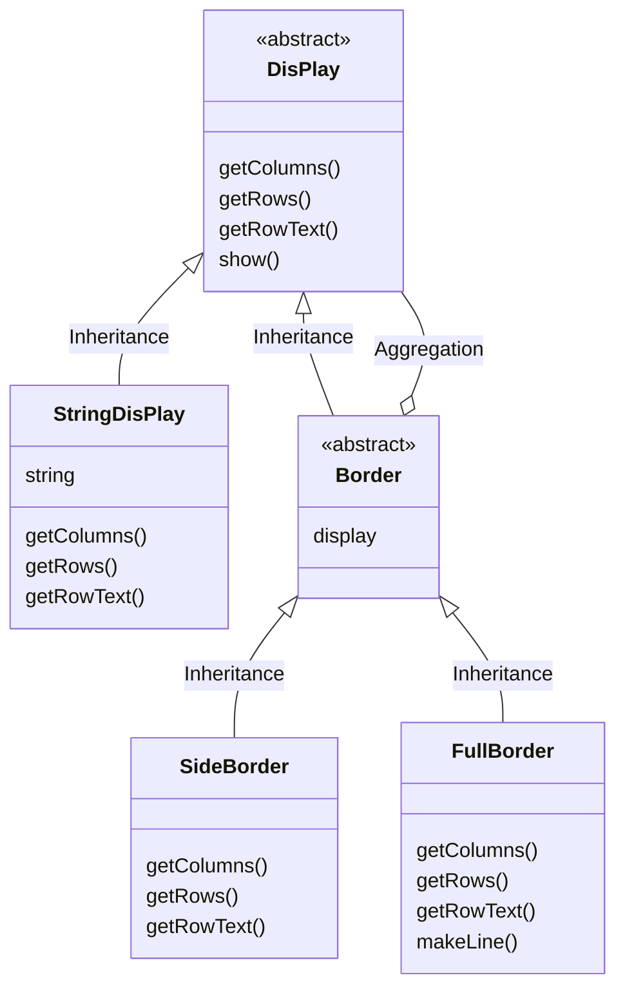

<H1>Decorator 模式</H1>

<H2>示例程序</H2>

为 Hellow World 添加装饰边框的示例

| 名字          | 说明                     |
| ------------- | ------------------------ |
| Display       | 用于显示字符串的抽象类   |
| StringDisplay | 用于显示单行字符串的类   |
| Border        | 用于显示装饰边框的抽象类 |
| SideBorder    | 用于只显示左右边框的类   |
| FullBorder    | 用于显示上下左右边框的类 |
| Main          | 测试程序行为的类         |

* UML图

